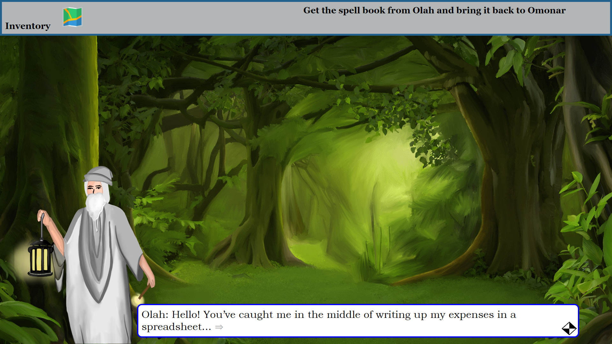

# Personal Development Planner Game

**Can serious games support the development of one’s personal skills by improving their motivation to engage with a personal development plan?**

This game was used as part of my investigation into the use of serious games to improve engagement with a personal development plan (PDP), which was the focus of my dissertation at the University of Bath.

## Motivation

Personal development plans are a great tool for developing one's own skills and reflecting upon their progression towards some personal goal if that person is motivated enough to correctly engage with their plan. However, people often find PDPs boring, and naturally they won't refer to their plan as often as they should. Due to this they are often not used to their full potential.

## Project aim

This project examines whether the use of gamification is more likely to engage a player in their plan, and if so, how much more effective would it be in developing the player’s skills.

To measure this effect I designed this serious game with the purpose of engaging the player in a story, and prompting them at certain points in the story to complete a task in real life that was related to the story and that would assist with their personal skills development. There are 3 tasks in total to complete as part of the game and the player is only allowed to continue playing the game once they complete a given task.

The game’s game's effectiveness in improving motivation to engage with a PDP was analysed by running a study involving students over the course of 1 week. Some students were given the game to play whilst others were given a traditional PDP to complete which outlined the same 3 tasks as the game. Students from both groups would answer questionnaires based off the Intrinsic Motivation Motivator and these responses would be compared to determine if the game had an effect on players' motivation.

The game's design was inspired by research and critical analysis on existing serious games and persuasive technology literature to understand what elements of game design can be used to persuade and motivate the player to perform certain activities.

## Tech

This repository holds code for a front-end web application written in [Angular 6](https://angular.io/).
All relevant code for the game can be found in the ./angular folder.

## Build

On a Linux or Windows command line (assuming all software and dependencies are installed), run `ng build --prod --base-href "/ph471/FYP/" --deploy-url "/ph471/FYP/"`.
Note that this command will not work correctly when run on Git Bash for Windows.
